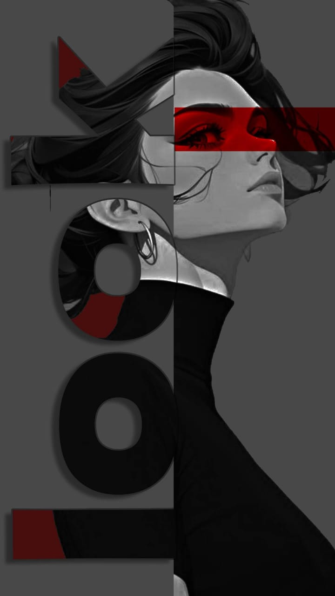
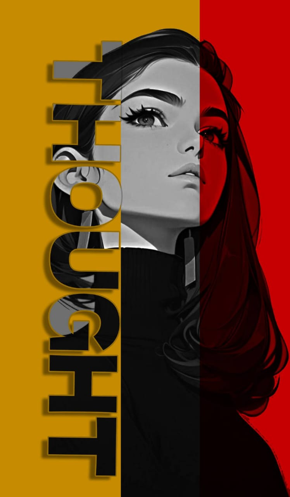

<!DOCTYPE html>
<html lang="en">
<head>

    <title>Km Seema</title>
    
</head>
<body>
    <header>
         Km Seema Website
    </header>
    

        <h2>Birthday Gift from me..</h2>
        
A simple website that shows some images and video

        <h2>Gallery</h2>
        

            
            
            
            
        

        <h2>Video Section</h2>
        

            <video controls>
                <source src="video1.mp4" type="video/mp4">
                Your browser does not support the video tag.
            </video>
        

    

    <footer>
        &copy; 2025 Km Seema Website. All rights reserved.
    </footer>
</body>
</html>
